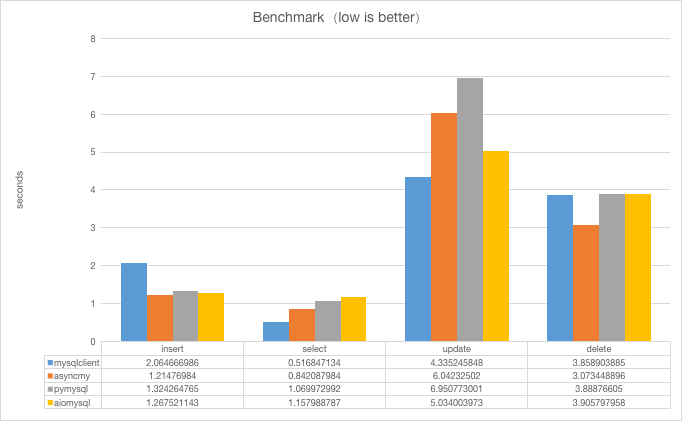

# asyncmy - A fast asyncio MySQL/MariaDB driver

[](https://pypi.python.org/pypi/asyncmy)
[](https://github.com/long2ice/asyncmy)
[](https://github.com/long2ice/asyncmy/actions/workflows/pypi.yml)
[](https://github.com/long2ice/asyncmy/actions/workflows/ci.yml)

## Introduction

`asyncmy` is a fast asyncio MySQL/MariaDB driver, which reuse most of [pymysql](https://github.com/PyMySQL/PyMySQL)
and [aiomysql](https://github.com/aio-libs/aiomysql) but rewrite core protocol with [cython](https://cython.org/) to
speedup.

## Features

- API compatible with [aiomysql](https://github.com/aio-libs/aiomysql).
- Faster by [cython](https://cython.org/).
- MySQL replication protocol support with `asyncio`.
- Tested both MySQL and MariaDB in [CI](https://github.com/long2ice/asyncmy/blob/dev/.github/workflows/ci.yml).

## Benchmark

The result comes from [benchmark](./benchmark).

> The device is iMac Pro(2017) i9 3.6GHz 48G and MySQL version is 8.0.26.



### Conclusion

- There is no doubt that `mysqlclient` is the fastest MySQL driver.
- All kinds of drivers have a small gap except `select`.
- `asyncio` could enhance `insert`.
- `asyncmy` performs remarkable when compared to other drivers.

## Install

```shell
pip install asyncmy
```

### Installing on Windows

To install asyncmy on Windows, you need to install the tools needed to build it.

1. Download *Microsoft C++ Build Tools* from https://visualstudio.microsoft.com/visual-cpp-build-tools/
2. Run CMD as Admin (not required but recommended) and navigate to the folder when your installer is downloaded
3. Installer executable should look like this `vs_buildtools__XXXXXXXXX.XXXXXXXXXX.exe`, it will be easier if you rename
   it to just `vs_buildtools.exe`
4. Run this command (Make sure you have about 5-6GB of free storage)

```shell
vs_buildtools.exe --norestart --passive --downloadThenInstall --includeRecommended --add Microsoft.VisualStudio.Workload.NativeDesktop --add Microsoft.VisualStudio.Workload.VCTools --add Microsoft.VisualStudio.Workload.MSBuildTools
```

5. Wait until the installation is finished
6. After installation will finish, restart your computer
7. Install asyncmy via PIP

```shell
pip install asyncmy
```

Now you can uninstall previously installed tools.

## Usage

### Use `connect`

`asyncmy` provides a way to connect to MySQL database with simple factory function `asyncmy.connect()`. Use this
function if you want just one connection to the database, consider connection pool for multiple connections.

```py
from asyncmy import connect
from asyncmy.cursors import DictCursor
import asyncio


async def run():
    conn = await connect()
    async with conn.cursor(cursor=DictCursor) as cursor:
        await cursor.execute("create database if not exists test")
        await cursor.execute(
            """CREATE TABLE if not exists test.asyncmy
    (
        `id`       int primary key auto_increment,
        `decimal`  decimal(10, 2),
        `date`     date,
        `datetime` datetime,
        `float`    float,
        `string`   varchar(200),
        `tinyint`  tinyint
    )"""
        )


if __name__ == '__main__':
    asyncio.run(run())
```

### Use `pool`

`asyncmy` provides connection pool as well as plain Connection objects.

```py
import asyncmy
import asyncio


async def run():
    pool = await asyncmy.create_pool()
    async with pool.acquire() as conn:
        async with conn.cursor() as cursor:
            await cursor.execute("SELECT 1")
            ret = await cursor.fetchone()
            assert ret == (1,)


if __name__ == '__main__':
    asyncio.run(run())
```

## Replication

`asyncmy` supports MySQL replication protocol
like [python-mysql-replication](https://github.com/noplay/python-mysql-replication), but powered by `asyncio`.

```py
from asyncmy import connect
from asyncmy.replication import BinLogStream
import asyncio


async def run():
    conn = await connect()
    ctl_conn = await connect()

    stream = BinLogStream(
        conn,
        ctl_conn,
        1,
        master_log_file="binlog.000172",
        master_log_position=2235312,
        resume_stream=True,
        blocking=True,
    )
    async for event in stream:
        print(event)


if __name__ == '__main__':
    asyncio.run(run())
```

## ThanksTo

> asyncmy is build on top of these awesome projects.

- [pymysql](https://github/pymysql/PyMySQL), a pure python MySQL client.
- [aiomysql](https://github.com/aio-libs/aiomysql), a library for accessing a MySQL database from the asyncio.
- [python-mysql-replication](https://github.com/noplay/python-mysql-replication), pure Python Implementation of MySQL
  replication protocol build on top of PyMYSQL.

## License

This project is licensed under the [Apache-2.0](./LICENSE) License.
